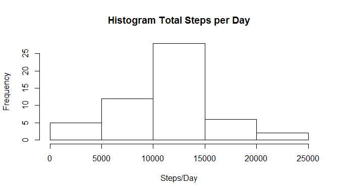
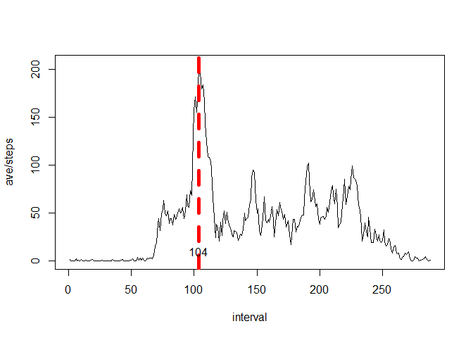
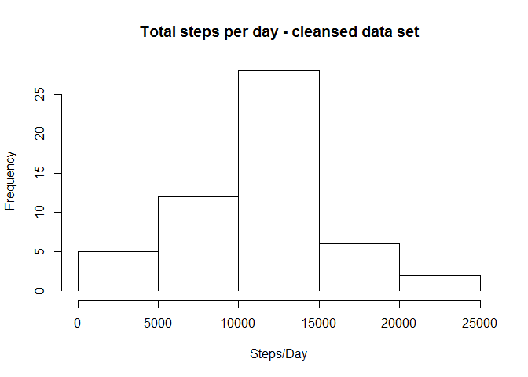
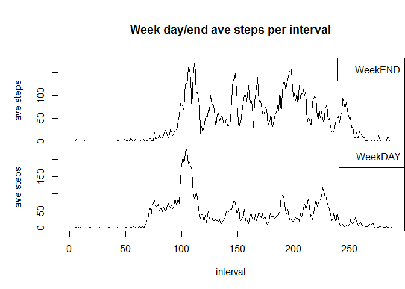

# Reproducible Research: Peer Assessment 1
Bill Schroeder  


## Loading and preprocessing the data
  
  

* Check for and install required libraries


```r
# check for required packages
if("lubridate" %in% rownames(installed.packages() ) == FALSE){
  install.packages("lubridate")}
library(lubridate)
```

* Load input file


```r
# read in the data
if(!file.exists("activity.csv")){
  unzip("activity.zip")
}
data <- read.csv( "activity.csv", header=TRUE, sep=",")
```


* Process/transform the data into a format suitable for your analysis


```r
# convert the dates (y/m/d) from factors to dates
data$date <- ymd(as.character(data$date))
```


## What is mean total number of steps taken per day? 
  
  

 


* Calculate the mean and median total number of steps taken per day


```r
sumStepsPerDay <- tapply (data$steps, data$date , sum)
meanTotalSteps <- mean( sumStepsPerDay, na.rm = TRUE )
medianTotalSteps <- median( sumStepsPerDay, na.rm = TRUE )
```

* The mean of the total number of steps taken per day is **10766.19** 

* The median of the total number of steps taken per day is **10765**


## What is the average daily activity pattern?
  
  
* Make a time series plot of the 5-minute interval (x-axis) and the average number of steps taken, averaged across all days (y-axis)


```r
# calculate the mean number of steps for each interval
meanStepsPerInterval <- tapply (data$steps, data$interval, mean, na.rm=TRUE)

# find the maximum mean value across all intervals
maxSteps <- max(meanStepsPerInterval) 

# find the interval that contains the maximum mean value
maxStepsInterval <- match( maxSteps, meanStepsPerInterval )

# create a time series plot of steps for all intervals 
plot(meanStepsPerInterval , type="l", xlab="interval", ylab="ave/steps")
abline( v=maxStepsInterval, lty=2, col="red", lwd="5")
text(maxStepsInterval,10,maxStepsInterval) 
```

 


* Which 5-minute interval, on average across all the days in the dataset, contains the maximum number of steps?


```r
# find the maximum mean value across all intervals
maxSteps <- max(meanStepsPerInterval) 

# find the interval that contains the maximum mean value
maxStepsInterval <- match( maxSteps, meanStepsPerInterval )
```

* Report the 5-minute interval that, on average, contains the maximum number of steps
    - The interval **104** contains the ave maximimum number of steps, which is **206.17**  
    

## Imputing missing values
  
  
* Calculate and report the total number of missing values in the dataset  
  

```r
# function to calculate total number of NAs
numNAs <- function( data ) {
	isNA <- is.na(data$steps)
	return (sum(isNA))
}
```

* Total number of NAs = **2304** Which is **13.11%**


* Devise a strategy for filling in all of the missing values in the dataset. Strategy is to replace NAs with ave/day
      + **Fill all mission values with the average steps per day**

* Create a new dataset that is equal to the original dataset but with the missing data filled in


```r
# clean the original data - replace NAs with average for day
cleansedData <- data
cleansedData$steps[ is.na(cleansedData$steps)] <- mean(cleansedData$steps, rm.na=TRUE)
```


* Make a histogram of the total number of steps taken each day

 


* Calculate and report the mean and median total number of steps taken per day


```r
# calculate the mean across all dates
mean(sumStepsPerDayCleansed, na.rm=TRUE)
```

```
## [1] 10766
```

```r
# calculate median across all dates
median(sumStepsPerDayCleansed, na.rm=TRUE)
```

```
## [1] 10765
```


* Do these values differ from the estimates from the first part of the assignment? 
* What is the impact of imputing missing data on the estimates of the total daily number of steps?


```r
meanDif <- mean(cleansedData$steps, na.rm=TRUE) -  mean( data$steps, na.rm = TRUE ) 
medianDif <- median(cleansedData$steps, na.rm=TRUE) -  median( data$steps, na.rm = TRUE )

if(meanDif != 0){
  print(sprintf("Cleaning the data DID impact the mean by %s ", meanDif) )
} else {
  print("Cleaning the data did NOT impact the mean")
}
```

```
## [1] "Cleaning the data did NOT impact the mean"
```

```r
if(medianDif != 0){
  print(sprintf("Cleaning the data DID impact the median by %s ", medianDif) )
} else {
  print("Cleaning the data did NOT impact the median")
}
```

```
## [1] "Cleaning the data did NOT impact the median"
```


## Are there differences in activity patterns between weekdays and weekends?

* Create a new factor variable in the dataset with two levels -- "weekday" and "weekend" indicating whether a given date is a weekday or weekend day.*


```r
# check if package "chron" is installed
if("chron" %in% rownames(installed.packages() ) == FALSE){
  install.packages("chron")
}
library("chron")
```

```
## 
## Attaching package: 'chron'
## 
## The following objects are masked from 'package:lubridate':
## 
##     days, hours, minutes, seconds, years
```

```r
# function returns if date is a weekend or weekday
dayOfWeekFactor <- function( date ){
  if( TRUE == factor(is.weekend(date) )){ 
    "weekend"
      } else {
        "weekday"
    }
}

# Create a new factor variable in the dataset with two levels# "weekday" and "weekend" 
cleansedData$DoW <- as.factor(sapply(cleansedData$date, dayOfWeekFactor))
```

* Make a panel plot containing a time series plot (i.e. type = "l") of the 5-minute interval (x-axis) and the average number of steps taken, averaged across all weekday days or weekend days (y-axis). 


 

  
